# Reference an on-premise LDAP repository using Mulesoft Technologies

## <u>Overview</u>

It is common for identity lifecycle processes to require advanced
calculations when managing user profiles- including calculations that
involve data not present immediately within the identity platform
itself. Examples include calculating unique usernames/email addresses
and determining proper mailstop values. This template is an example of
referring to an LDAP repository to perform a generic search within Okta
workflows. It can be modified and applied to any sort of repository such
as a SQL database.

## <u>Design Notes</u>

This example leverages the Mulesoft Anypoint platform to host the API
endpoint consumed by Okta workflows.

Flow:

1.  A user’s identity is maintained in the identity source of record.

2.  A lifecycle event in Okta triggers a workflow to execute.

3.  The workflow obtains a valid OAuth2 access token from Okta to
    > execute the API.

4.  The workflow then invokes the configured HTTP endpoint on MuleSoft
    > Anypoint to execute the search. The access token issued by Okta is
    > included to authorize the transaction.

5.  The Anypoint platform validates the access token.

6.  The configured Mule flow is invoked to execute the LDAP search.

7.  The LDAP search results are obtained by the Mule flow, and returned
    > to Okta Workflows.

## <u>Before you get Started / Prerequisites</u>

Before you get started, here are the things you’ll need:

1.  Access to an Okta tenant with Okta Workflows enabled for your org.

2.  Access to an Okta tenant with API AM enabled (can be the same as the
    > Workflows org).

3.  Access to an Anypoint platform tenant to create the appropriate
    > endpoints.

4.  An on-premise server that will host the Anypoint [<u>Runtime Manager
    > Agent</u>](https://docs.mulesoft.com/runtime-manager/runtime-manager-agent).
    > This server will be where the LDAP calls are made from. We’ll be
    > using the UI on the server, so these instructions assume that you
    > are using Windows server.

5.  Service account credentials to the LDAP repository you wish to
    > query.

##  

## <u>Setup Steps - Okta Tenant</u>

There are a few components that must be setup within the Okta tenant in
order to support this integration:

1.  A service identity that will be authenticated as when minting a
    > token.

2.  An OAuth2 client that will be used when authorizing to the
    > authorization server.

3.  An Okta OAuth2 authorization server.

###  

### Setup the Service Account

In Okta create a new user that will be used by Okta Workflows to obtain
an OAuth2 token.

***Note: Any user within Okta may be used for this, but as a best
practice a user not belonging to a person should be used.***

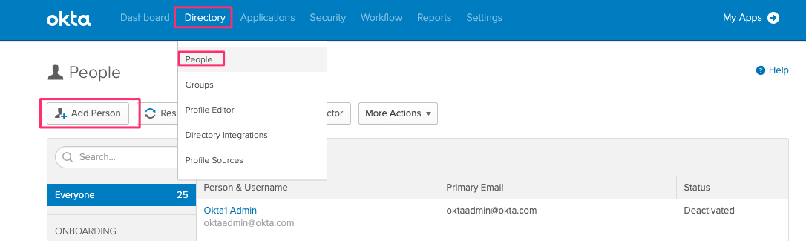

Create the user as shown.

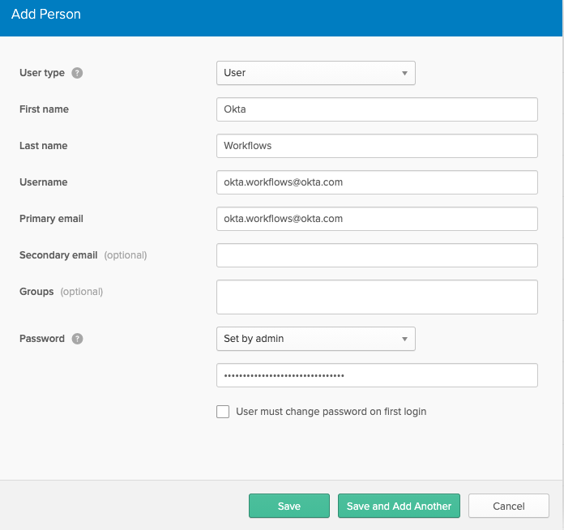

### Setup the OAuth2 Client

In the Okta tenant, Add an application, as shown.

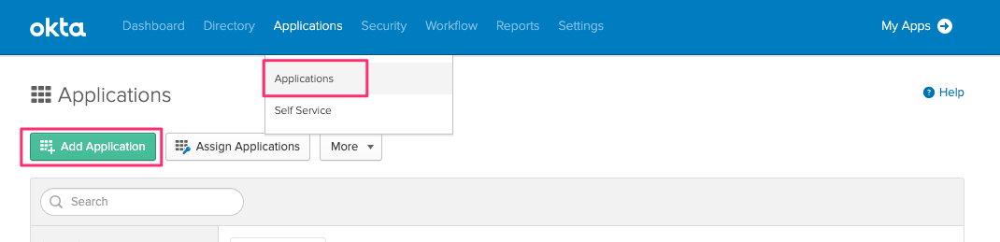

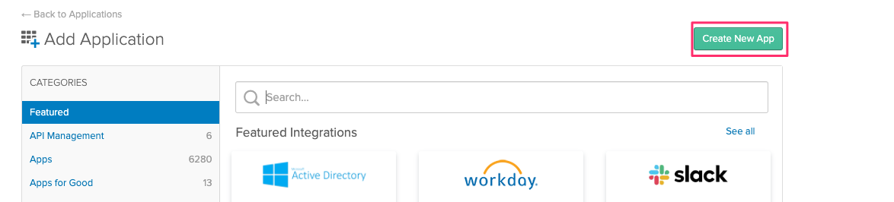

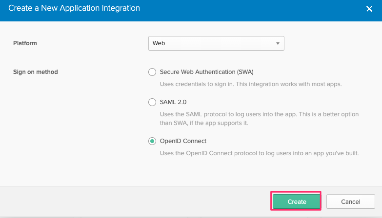

When asked for OIDC details, provide the following:

**Application Name**: Whatever you’d like to call it

**Login Redirect URI**:
***[<u>https://oauth.workflows.oktapreview.com/oauth/httpfunctions/cb</u>](https://oauth.workflows.oktapreview.com/oauth/httpfunctions/cb)
(non-production)***

***[<u>https://oauth.workflows.okta.com/oauth/httpfunctions/cb</u>](https://oauth.workflows.oktapreview.com/oauth/httpfunctions/cb)
(production)***

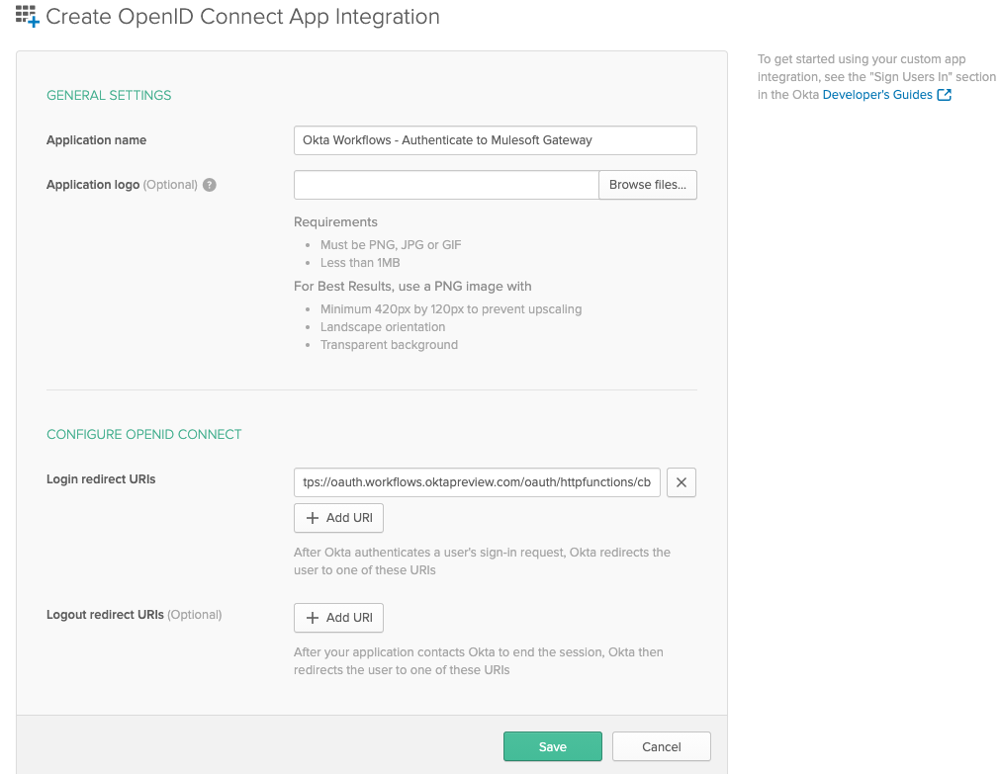

Once the application is created, you’ll be brought to an application
configuration screen. In the general settings, make the following 2
changes:

**Allowed Grant Types:** Check “Refresh Token” in addition to
“Authorization Code”

**User Consent**: Uncheck “Require consent”

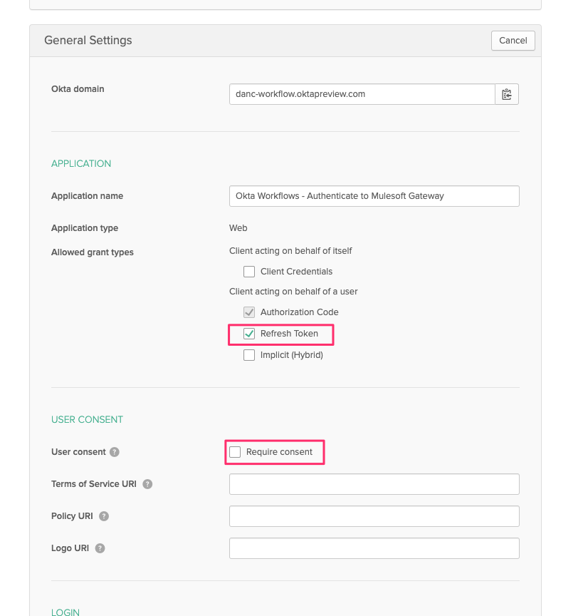

### Assign the Non-personal Identity to the application:

Use the assign button to assign the user you created in the previous
step.

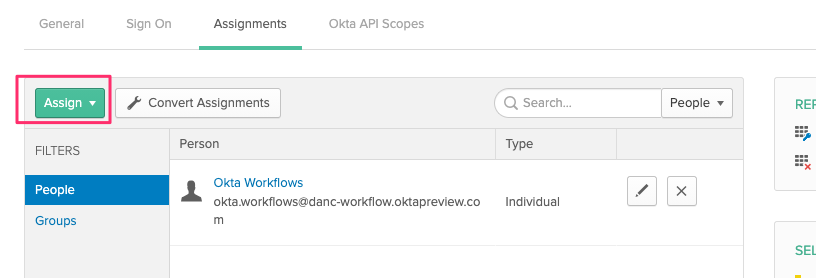

### Setup the Okta Authorization Server

In Okta’s Authorization Server screen, click “Add Authorization Server”,
as shown.

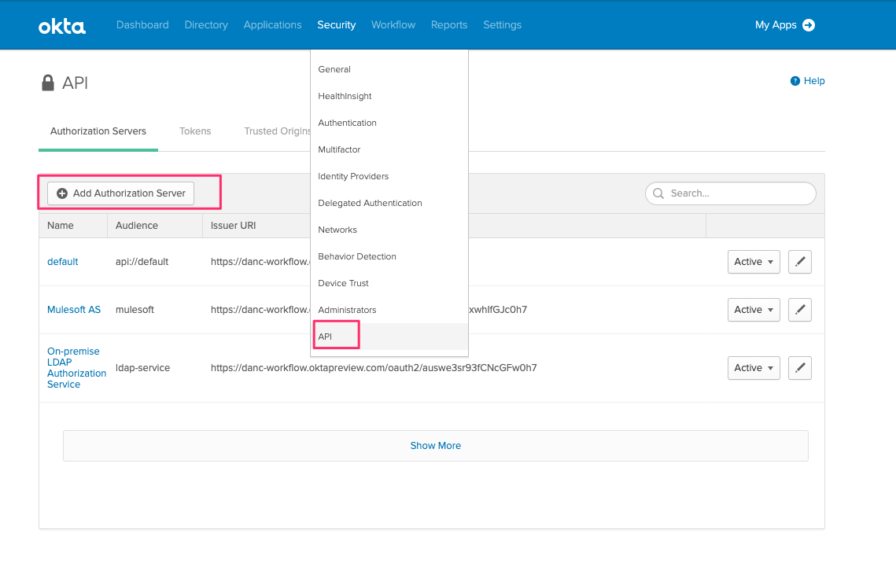

Provide a name and audience for your authz server. Keep note of your
audience value!

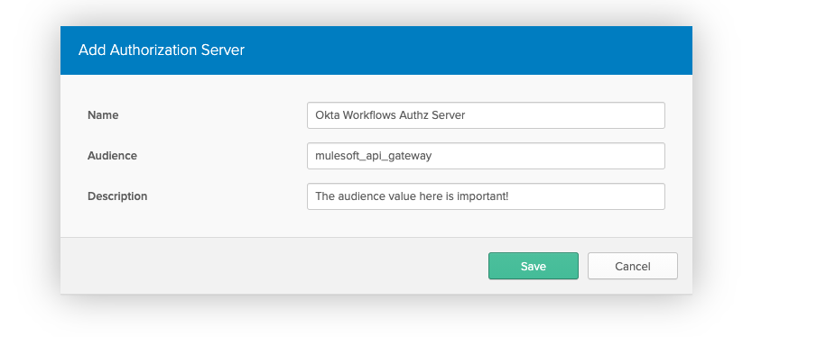

Create a new scope called api:read that will be requested by Okta
workflows:

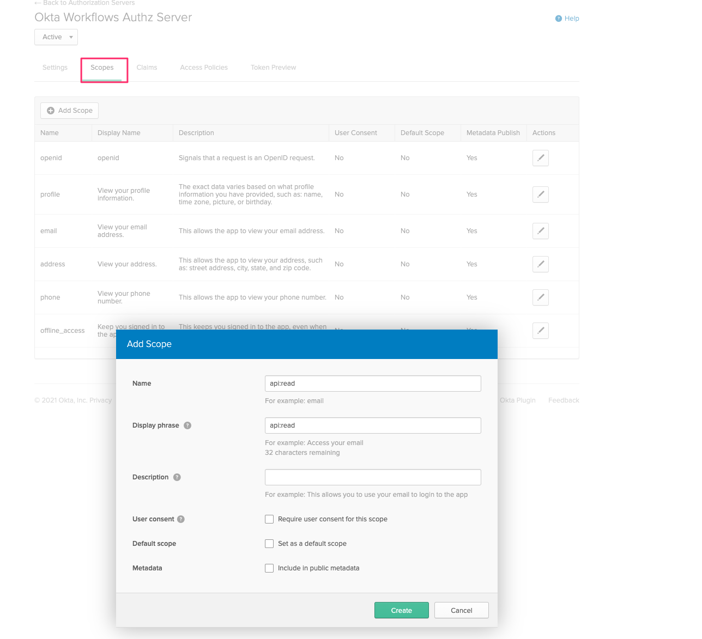

Create a new authorization policy that will allow Okta Workflows to
request the following 2 scopes:

-   api:read

-   offline\_access (refresh tokens)

When you first create the policy, be sure to select the application you
just created, as shown.

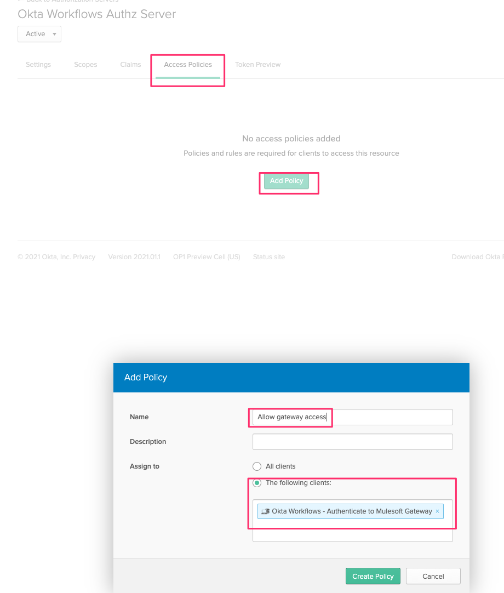

Add a rule to the policy, as shown.

It is important to select both the “api:read and offline\_access”
scopes.

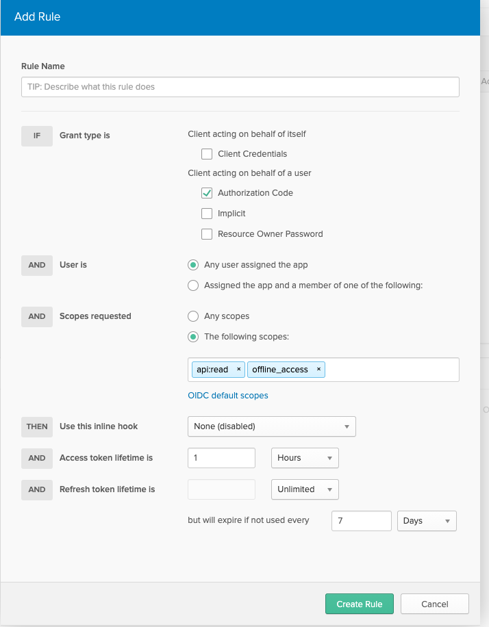

##  

## <u>Setup Steps - Mulesoft Anypoint Platform</u>

This section outlines how to configure the necessary components in the
Anypoint platform to achieve this integration:

-   A server running the Runtime Manager Agent

-   A Mule flow that contains the LDAP connector- deployed to the server

-   A proxy endpoint used to expose the Mule flow in a secure manner

-   A valid OAuth2/OIDC integration

### Install the Runtime Manager Agent

On the server, download the Mulesoft Runtime to the server:

[<u>https://docs.mulesoft.com/mule-runtime/4.2/runtime-installation-task</u>](https://docs.mulesoft.com/mule-runtime/4.2/runtime-installation-task)

In the Anypoint platform, add a new server to the Runtime Manager as
shown:

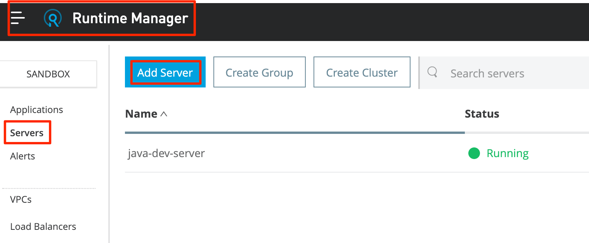

The Anypoint Platform will give you a specialized command to run on the
server. In the /bin directory of the Mulesoft runtime, execute this
“amc\_setup” command the platform gives you.

After that step is done, execute the following command to install the
Mulesoft platform as a Windows service:

/bin/mule.bat install

/bin/mule.bat start

When all is said and done, you should see in the Runtime Manager a
service with a status of “Running”, like shown above.

### Configure the Mule Flow

The Mule flow is the component that will be deployed to the on-premise
server, and will actually speak to the LDAP endpoint.

In Anypoint, go to the Design Center. Press the “Create new” button to
create a new application. When you’re asked what type of application to
create, select “Create new application”.

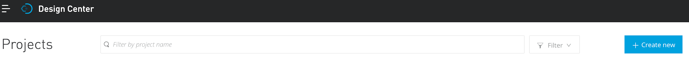

Choose a name for your app.

Setup the application trigger as shown:

Press Next.

Setup the application target as shown:

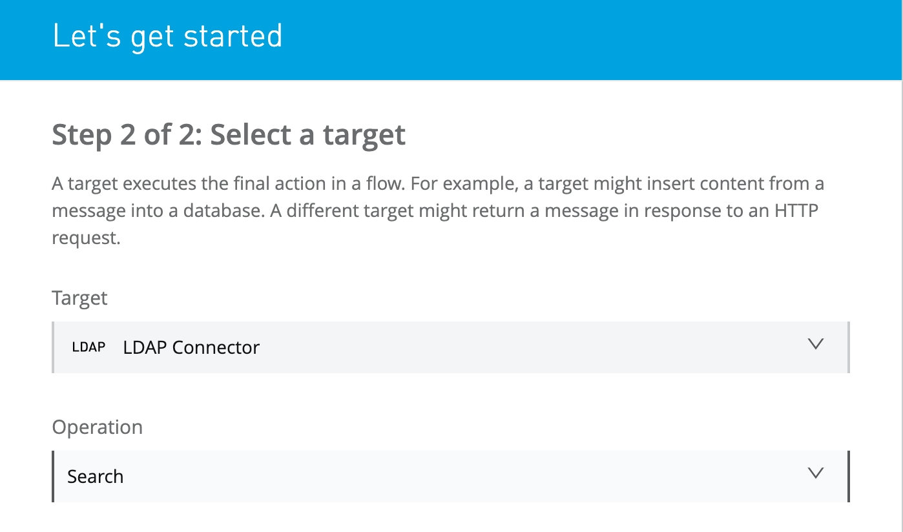

Press Done.

After you finish the creation wizard, you’ll be presented with the
configuration for the inbound HTTP listener for the application.

Enter a relative path for the HTTP endpoint as shown:

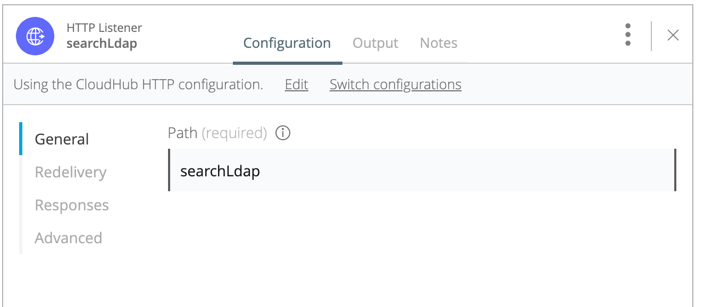

In the Responses tab, click the Add button in the Headers section to add
a header with Content-Type = application/json to indicate to Okta
workflows that the information passed back is in JSON format:

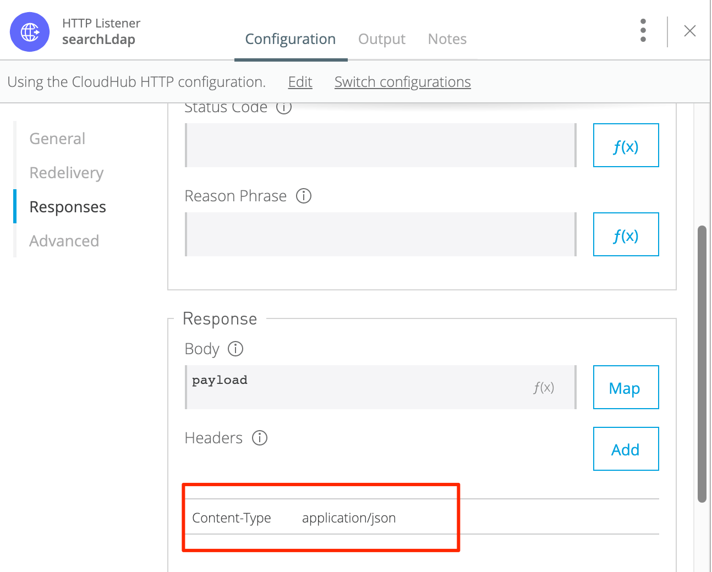

Once complete, this dialog can be closed.

Now, click on the LDAP card in the flow, and configure as shown:

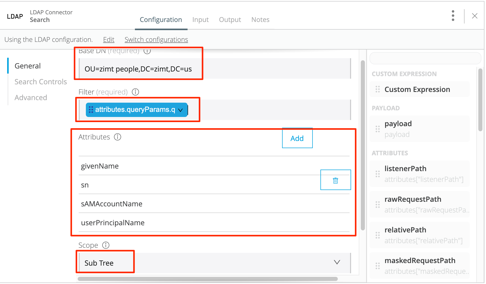

**Base DN:** This will be the OU you wish to limit your search to, in DN
format.

**Filter:** Put in the value \#\[attributes.queryParams.q\] to indicate
that we wish to use the querystring variable “q” to specify our query.

**Attributes:** Configure whatever LDAP attributes you wish to retrieve
from the directory.

**Scope:** Use Sub Tree as shown.

Next click on the “create LDAP configuration” link to create a new LDAP
configuration- this is where the credentials and directory host
information are set up.

***Note- the actual values do not matter at this time- they will be
configured properly when the application is deployed to the server.***

Click “Save”.

Next we need to add a new transform to the flow- this will simply take
the values from the LDAP entry objects returned from the LDAP connector,
and will output JSON that we can parse on the Okta side.

Close the LDAP connector configuration card.

Click on the “+” icon to add a new “Transform” object:

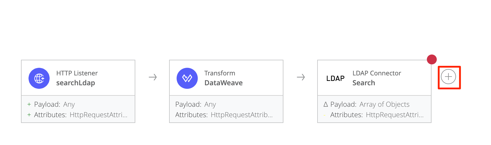

When you add the new transform object, you’ll be presented with a
configuration screen as shown. The quickest way to configure this is to
switch to the “script” view, and put in an example. In this example, the
values from the LDAP directory are on the right:

payload map(item, index) -&gt; {

FirstName: item.givenName,

LastName: item.sn,

upn: item.userPrincipalName,

samaccountname: item.sAMAccountName

}

You may of course add additional fields if you configured any on the
LDAP card.

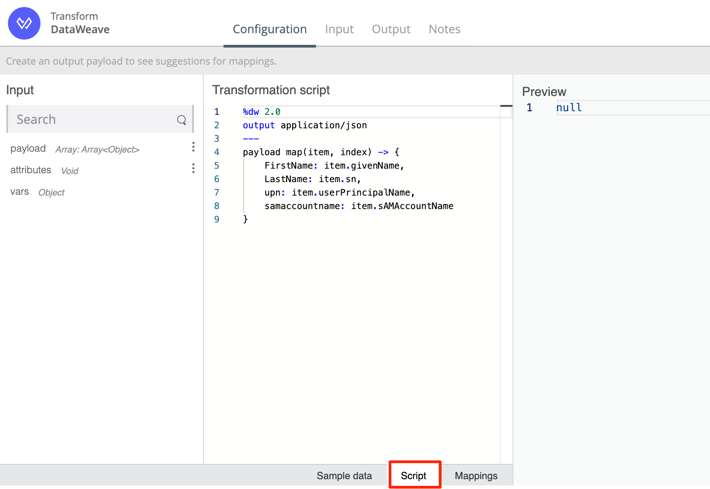

Close the Transform card.

You are now complete with the creation of your Mule app!

The final step in the Design Center is to export your application for
deployment. To do this, use the export menu item on the far right corner
of the Design Center.

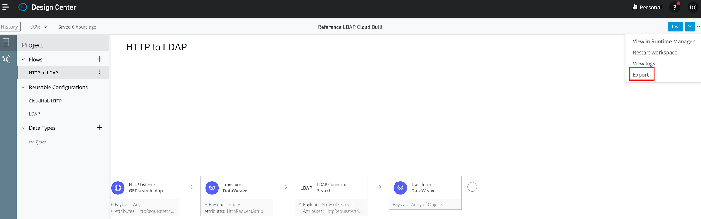

We need to export this as a mule application. A jar file will be saved
to your desktop.

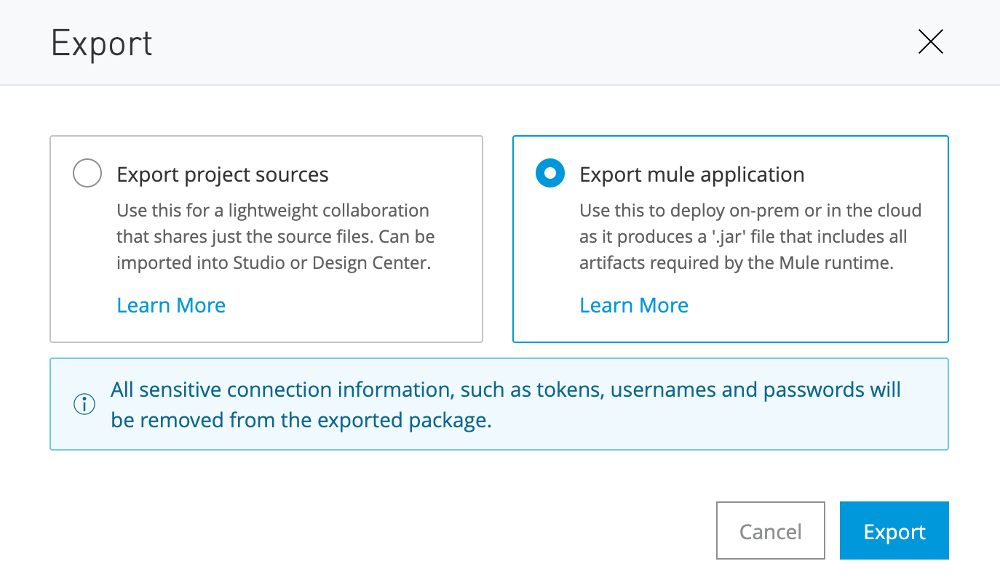

### Deploy the Application to your On-Premise Server

Now, we need to deploy the application to your server that you onboarded
in the first section of this guide.

Open the “Runtime Manager”, and click on the “Deploy Application”, as
shown:

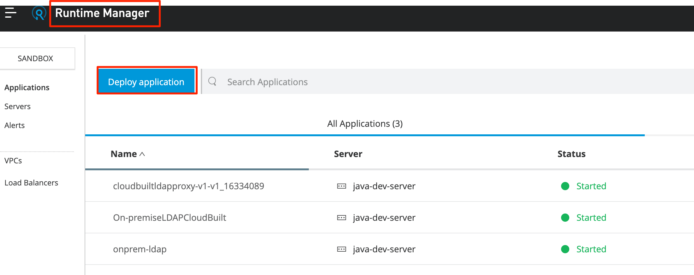

Provide the following:

Application Name: Whatever you wish to call it

Deployment Target: Select your server here

Application File: Select the .jar file from your computer that you
downloaded in the last section.

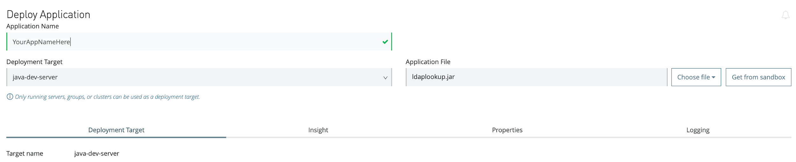

Go to the “Properties” tab, and put in your LDAP connection information:

ldap.Connection.url.value: The LDAP server host information.

ldap.Connection.authPassword.value: The password to use to authenticate
to the directory.

ldap.Connection.authDn.value: The service account credential to use to
authenticate to the directory.

cloudhub\_http.Connection.host.value: 1

cloudhub\_http.Connection.port.value: 8084 (The local HTTP endpoint will
be hosted here).

***Note- keep in mind that this HTTP endpoint is not going to be
internet accessible. It will be exposed via a proxy that we’ll set up
next.***

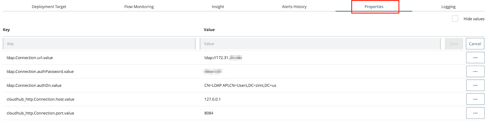

Click on “Deploy Application”.

Your LDAP endpoint is now ready for use!

### Set up the Secure Proxy

In order to securely expose the Mule endpoint to Okta, we need to create
a publicly accessible proxy endpoint that will perform OAuth2
authentication with Okta.

Go into the API Manager section of the Anypoint platform, and create a
new API:

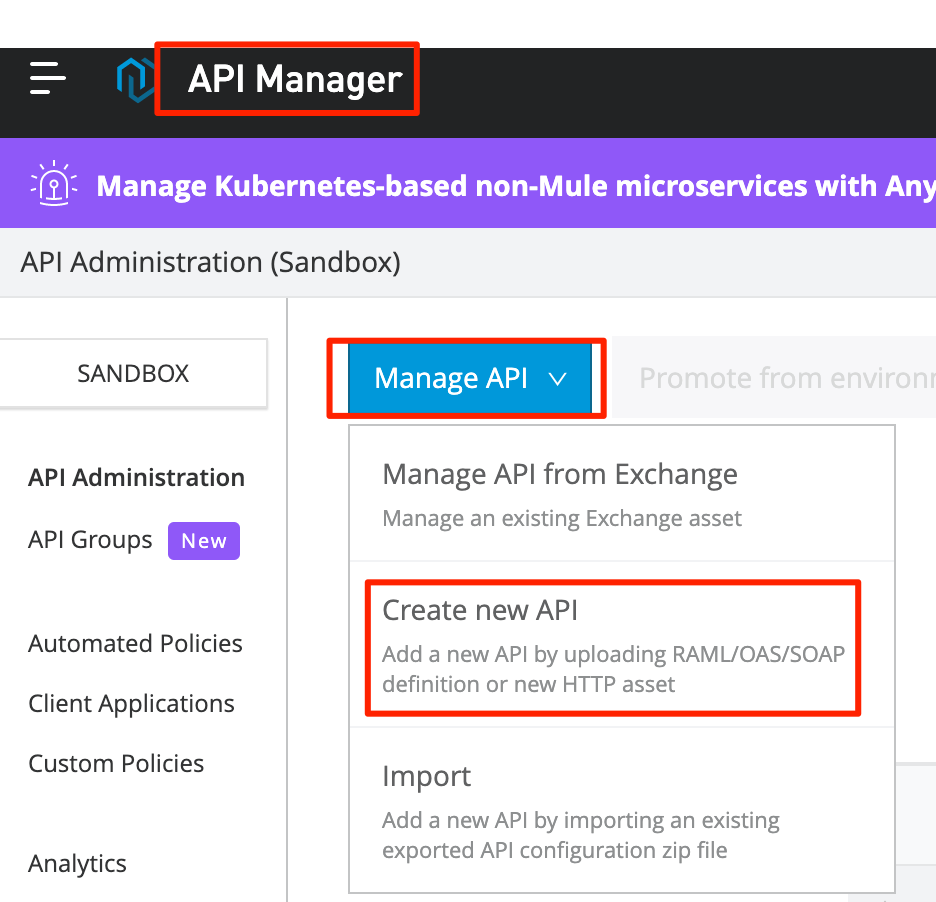

As shown, the type of API will be an “HTTP
API”.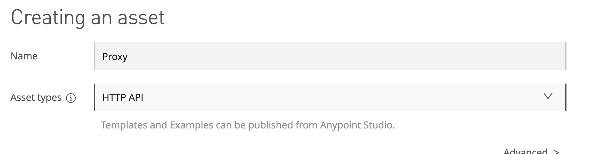

Click continue.

Set up the API as shown.

***Note- for the “Implementation URI”, you’ll put the private host/port
of the machine running the MuleSoft runtime agent. If you did not use
8084 for your cloudhub.Connection.port (or even host) parameters, you
need to change that implementation URI accordingly.***

Now we need to apply a JWT validation policy so that proper OAuth2
validation is required to call the API. Add the policy as shown:

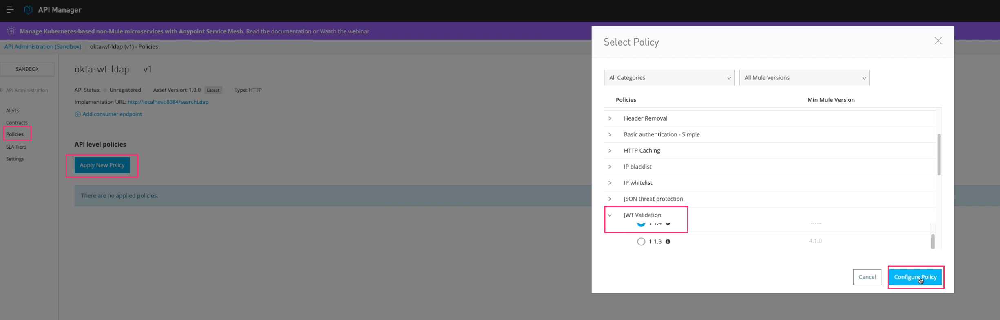

When configuring the policy, there are 2 fields that are specific to the
Okta authorization server you created earlier in this guide:

**Audience Claim**: This must be the audience value from your
authorization server.

**JWKS Url**: This is the “keys\_endpoint” metadata that can be found in
the OAuth2 well-known metadata endpoint (as highlighted in the
screenshot).

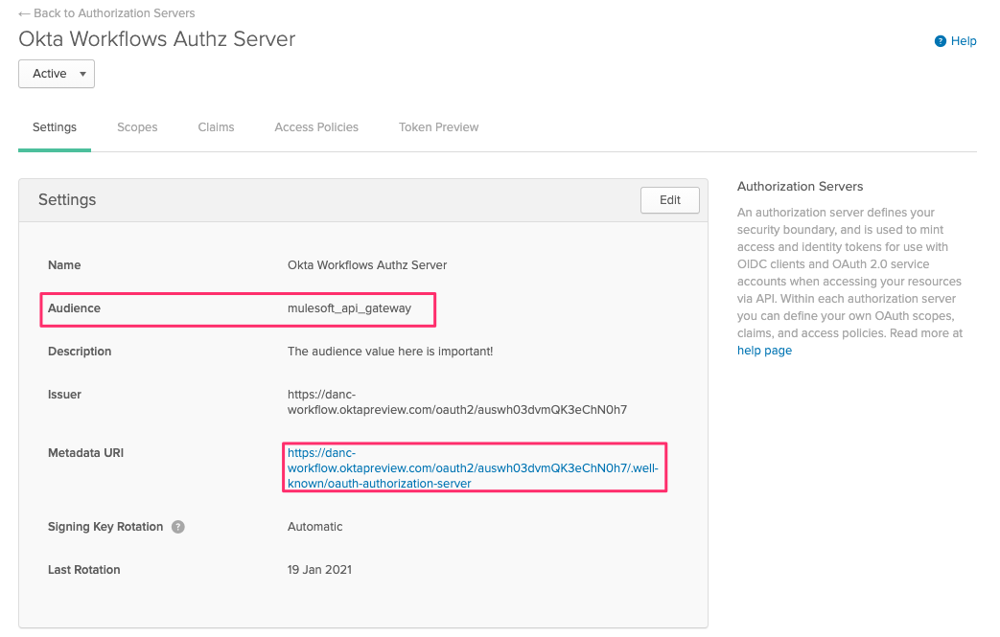

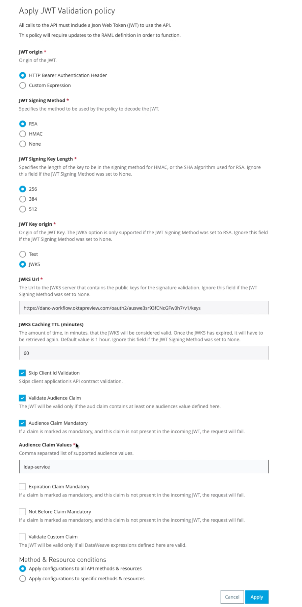

Now you may deploy your API.

Click on Settings.

Note that requests will not yet be allowed because we have not properly
configured our OAuth2 authorization server within Okta.

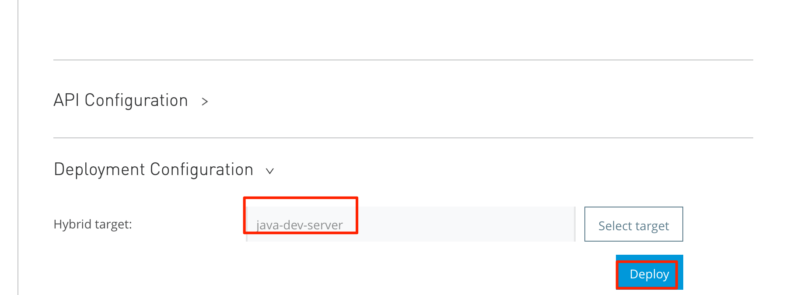

## <u>Setup Steps - Okta Workflow</u>

Now that the complete environment is set up, now let’s ensure the
workflow has the correct API gateway endpoint configured within it.

There are 3 steps necessary to completing the Workflow configuration.

1.  Create a new HTTP endpoint within Okta workflows that will store the
    > OAuth2 tokens for use in calling the LDAP gateway service.

-   Authentication Type: OAuth2

-   Authorize Path: Plug in your authorization server /authorize
    > endpoint here.

-   Token Path: Plug in your authorization server /token endpoint here.

-   Scope: Use the value (without quotes) “api:read offline\_access”

-   Client ID: Use the client id of the app you created during your Okta
    > setup.

-   Client Secret: Use the client secret of the app you created in the
    > Okta setup.

-   When you finish, Okta will ask you to login- login with the
    > non-personal credentials you created during the Okta setup.

2.  Update the gateway URL card with the appropriate URL you obtained at
    > the end of the API setup section.

3.  Update the HTTP card to use the new connection you just created in
    > step 1.

<u>Testing this Flow</u>

The flow included with this template is intended to be executed as part
of a higher level parent workflow. It takes in a single parameter,
“ldapFilter”, and the response will be a JSON array of elements found in
the LDAP directory. There is no limit to the objects returned other than
the LDAP query passed in!

Inputs: ldapFilter - when you invoke the workflow, put in a valid LDAP
query string.

Output: JSON array of LDAP entries.
